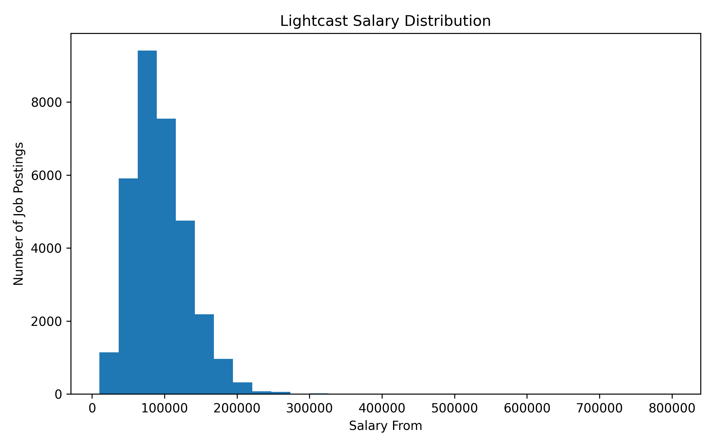
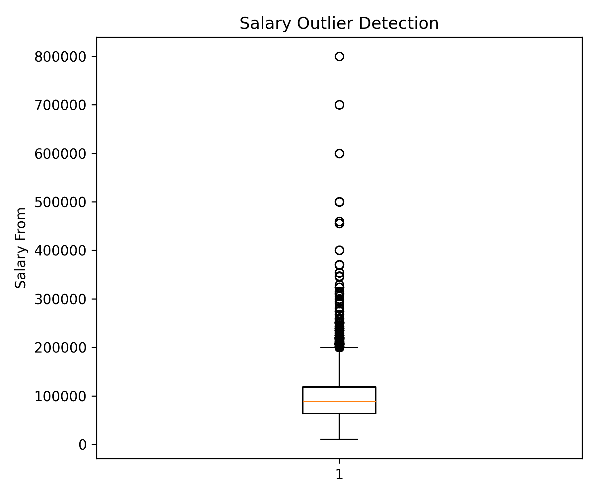
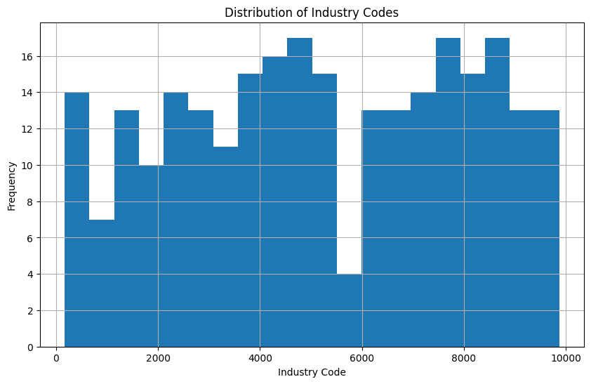

## Overview

Exploratory Data Analysis of the 2024 Lightcast job postings and IPUMS employment datasets.

---

## Alina: Salary Analysis from Lightcast

This section analyzes salary information from Lightcast job postings. The salary table contains 72,498 job postings, but only 32,398 postings include salary information, meaning approximately 55.3% of postings do not disclose salary fields.



The salary distribution shows that most postings with disclosed salary information cluster below the highest-paying outliers. The median lower-bound salary is approximately $88,000, while the mean is about $94,005, suggesting a right-skewed distribution.



The boxplot confirms that salary postings contain substantial high-end outliers. This suggests that salary transparency and compensation levels vary widely across job postings and occupational categories.

## Alina: IPUMS Industry Distribution Analysis

The IPUMS dataset contains 264 industry categories.



The histogram illustrates the distribution of industry codes across the lookup table.

---

## Julie: Gender & Wages (IPUMS)

### Setup

```{python}
import sys
sys.path.insert(0, "..")
from analysis.utils import load_employment, PLOTLY_THEME, save_fig
import plotly.express as px

df_emp = load_employment()
print(f"Rows: {len(df_emp):,} | Columns: {list(df_emp.columns)}")
```

### Gender Wage Gap by Industry

```{python}
agg = (df_emp.groupby(["INDUSTRY", "SEX_LABEL"])["INCWAGE"]
       .mean().reset_index()
       .rename(columns={"INCWAGE": "AVG_WAGE"}))

fig_a1 = px.bar(
    agg, x="AVG_WAGE", y="INDUSTRY",
    color="SEX_LABEL", barmode="group",
    orientation="h",
    title="Average Wage by Industry and Gender",
    labels={"AVG_WAGE": "Avg Annual Wage", "INDUSTRY": "Industry"},
    **PLOTLY_THEME
)
save_fig(fig_a1, "julie_gender_wage_industry")
fig_a1.show()
```

### Gender Wage Gap by State

```{python}
agg_state = (df_emp.groupby(["STATE_NAME", "SEX_LABEL"])["INCWAGE"]
             .mean().reset_index()
             .rename(columns={"INCWAGE": "AVG_WAGE"}))

fig_a2 = px.choropleth(
    agg_state,
    locations="STATE_NAME",
    locationmode="USA-states",
    color="AVG_WAGE",
    scope="usa",
    facet_col="SEX_LABEL",
    title="Average Wage by State and Gender",
    **PLOTLY_THEME
)
save_fig(fig_a2, "julie_gender_wage_state")
fig_a2.show()
```

---

## Julie: Job Market Trends (Lightcast)

### Setup

```{python}
from analysis.utils import load_job_postings, load_location, save_fig
import plotly.express as px

df_jobs = load_job_postings()
print(f"Job postings: {len(df_jobs):,} | Columns: {list(df_jobs.columns)}")
```

### B2 — Postings by State

```{python}
df_loc = load_location()
df_jobs_state = (df_jobs
    .merge(df_loc[["ID", "STATE_CODE"]], on="ID", how="left")
    .dropna(subset=["STATE_CODE"]))

agg_state = (df_jobs_state.groupby("STATE_CODE")
             .size().reset_index(name="POSTING_COUNT")
             .sort_values("POSTING_COUNT", ascending=False))

fig_b2 = px.bar(
    agg_state, x="STATE_CODE", y="POSTING_COUNT",
    title="Job Postings by State",
    labels={"STATE_CODE": "State", "POSTING_COUNT": "Postings"},
    **PLOTLY_THEME
)
save_fig(fig_b2, "julie_postings_by_state")
fig_b2.show()
```

---

## Julie: Female Wage vs Job Market Activity (Cross-Dataset)

### Setup

```{python}
import pandas as pd

# Female avg wage by state — IPUMS
female_wage = (df_emp[df_emp["SEX_LABEL"] == "Female"]
               .groupby("STATE_NAME")["INCWAGE"]
               .mean().reset_index()
               .rename(columns={"INCWAGE": "AVG_FEMALE_WAGE"}))

# State abbreviation bridge (IPUMS full names → 2-letter codes)
abbrev = {
    "Alabama":"AL","Alaska":"AK","Arizona":"AZ","Arkansas":"AR","California":"CA",
    "Colorado":"CO","Connecticut":"CT","Delaware":"DE","District of Columbia":"DC",
    "Florida":"FL","Georgia":"GA","Hawaii":"HI","Idaho":"ID","Illinois":"IL",
    "Indiana":"IN","Iowa":"IA","Kansas":"KS","Kentucky":"KY","Louisiana":"LA",
    "Maine":"ME","Maryland":"MD","Massachusetts":"MA","Michigan":"MI","Minnesota":"MN",
    "Mississippi":"MS","Missouri":"MO","Montana":"MT","Nebraska":"NE","Nevada":"NV",
    "New Hampshire":"NH","New Jersey":"NJ","New Mexico":"NM","New York":"NY",
    "North Carolina":"NC","North Dakota":"ND","Ohio":"OH","Oklahoma":"OK","Oregon":"OR",
    "Pennsylvania":"PA","Rhode Island":"RI","South Carolina":"SC","South Dakota":"SD",
    "Tennessee":"TN","Texas":"TX","Utah":"UT","Vermont":"VT","Virginia":"VA",
    "Washington":"WA","West Virginia":"WV","Wisconsin":"WI","Wyoming":"WY"
}
female_wage["STATE_CODE"] = female_wage["STATE_NAME"].map(abbrev)

# Posting count by state — Lightcast
posting_count = (df_jobs_state.groupby("STATE_CODE")
                 .size().reset_index(name="POSTING_COUNT"))

# Merge
cross = female_wage.merge(posting_count, on="STATE_CODE").dropna()
r = cross["AVG_FEMALE_WAGE"].corr(cross["POSTING_COUNT"])
print(f"States: {len(cross)} | r = {r:.3f}")
```

### C1 — Female Wage vs Job Posting Volume by State

```{python}
fig_c1 = px.scatter(
    cross,
    x="POSTING_COUNT",
    y="AVG_FEMALE_WAGE",
    text="STATE_CODE",
    title=f"Female Avg Wage vs Job Posting Volume by State (r = {r:.2f})",
    labels={
        "POSTING_COUNT": "Job Postings (Lightcast)",
        "AVG_FEMALE_WAGE": "Avg Female Wage (IPUMS)"
    },
    **PLOTLY_THEME
)
fig_c1.update_traces(textposition="top center", marker=dict(size=8))
save_fig(fig_c1, "julie_cross_state_comparison")
fig_c1.show()
```
