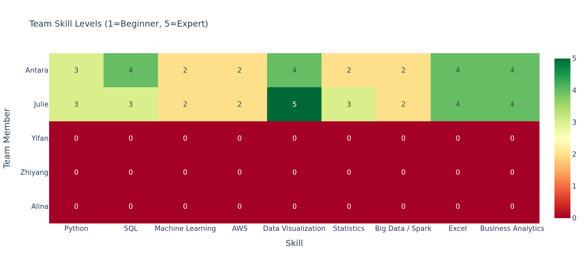
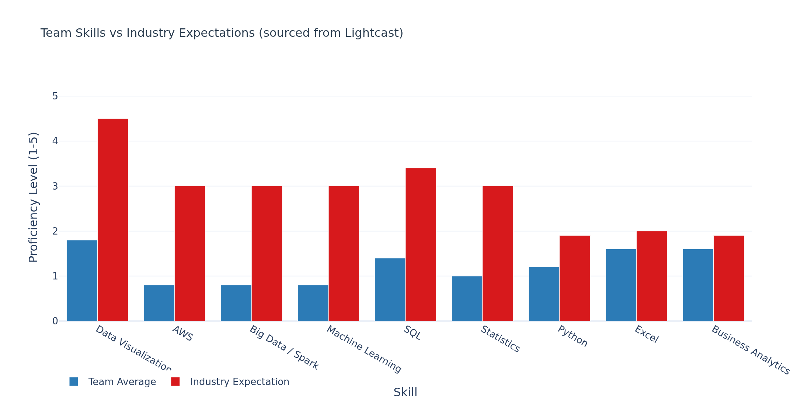

## Overview

This section compares the most in-demand skills from Lightcast 2024 IT job postings against the actual skills of our group members to identify knowledge gaps and areas for improvement.

Proficiency scale: **1 = Beginner → 5 = Expert**

---

## Team Skill Levels

```{python}
import pandas as pd
import plotly.express as px
import plotly.graph_objects as go
import os

# Shared Plotly theme — must match eda.qmd
PLOTLY_THEME = dict(
    template="plotly_white",
    font=dict(family="Arial", size=13),
    title_font=dict(size=16, color="#2c3e50"),
    colorway=["#2c7bb6", "#d7191c", "#fdae61", "#1a9641"]
)

# TODO: Yifan, Zhiyang, Alina — fill in your own row before final submission
skills_data = {
    "Name":               ["Antara", "Julie", "Yifan", "Zhiyang", "Alina"],
    "Python":             [3,         3,       0,        3,         0],
    "SQL":                [4,         3,       0,        3,         0],
    "Machine Learning":   [2,         2,       0,        2,         0],
    "AWS":                [2,         2,       0,        5,         0],
    "Data Visualization": [4,         5,       0,        3,         0],
    "Statistics":         [2,         3,       0,        2,         0],
    "Big Data / Spark":   [2,         2,       0,        2,         0],
    "Excel":              [4,         4,       0,        5,         0],
    "Business Analytics": [4,         4,       0,        4,         0],
}

df_skills = pd.DataFrame(skills_data).set_index("Name")
df_skills
```

---

## Skill Heatmap

```{python}
os.makedirs("assets/figures", exist_ok=True)

fig = px.imshow(
    df_skills,
    text_auto=True,
    color_continuous_scale="RdYlGn",
    zmin=0, zmax=5,
    aspect="auto",
    title="Team Skill Levels (1=Beginner, 5=Expert)",
    template="plotly_white"
)
fig.update_layout(
    font=PLOTLY_THEME["font"],
    title_font=PLOTLY_THEME["title_font"],
    xaxis_title="Skill",
    yaxis_title="Team Member"
)
fig.write_image("assets/figures/skill_heatmap.png", width=1100, height=500, scale=2)
fig.show()
```



---

## Top In-Demand Skills from Lightcast Job Postings

```{python}
# Read pre-computed top skills from ETL output — no raw data loaded here
df_top_skills = pd.read_csv("../data/processed/lightcast_top_skills.csv")
df_top_skills
```

---

## Team Average vs Industry Requirements

```{python}
skill_map = {
    "SQL (Programming Language)":   "SQL",
    "Python (Programming Language)": "Python",
    "Data Analysis":                "Data Visualization",
    "Microsoft Excel":              "Excel",
    "SAP Applications":             "Business Analytics",
}

max_count = df_top_skills["Count"].max()
industry_exp = {}
for _, row in df_top_skills.iterrows():
    mapped = skill_map.get(row["Skill"])
    if mapped and mapped in df_skills.columns:
        industry_exp[mapped] = round((row["Count"] / max_count) * 5, 1)
for skill in df_skills.columns:
    if skill not in industry_exp:
        industry_exp[skill] = 3.0

team_avg = df_skills.mean().round(2)
gap_df = pd.DataFrame({
    "Team Average":         team_avg,
    "Industry Expectation": pd.Series(industry_exp),
}).reset_index().rename(columns={"index": "Skill"})
gap_df["Gap"] = (gap_df["Industry Expectation"] - gap_df["Team Average"]).round(2)
gap_df = gap_df.sort_values("Gap", ascending=False)

fig2 = go.Figure()
fig2.add_trace(go.Bar(name="Team Average", x=gap_df["Skill"], y=gap_df["Team Average"], marker_color="#2c7bb6"))
fig2.add_trace(go.Bar(name="Industry Expectation", x=gap_df["Skill"], y=gap_df["Industry Expectation"], marker_color="#d7191c"))
fig2.update_layout(
    barmode="group",
    title="Team Skills vs Industry Expectations (sourced from Lightcast)",
    xaxis_title="Skill",
    yaxis_title="Proficiency Level (1-5)",
    yaxis=dict(range=[0, 5.5]),
    legend=dict(orientation="h", y=-0.2),
    font=PLOTLY_THEME["font"],
    title_font=PLOTLY_THEME["title_font"],
    template=PLOTLY_THEME["template"]
)
fig2.write_image("assets/figures/skill_gap_bar.png", width=1100, height=550, scale=2)
fig2.show()
```



---

## Improvement Plan

| Team Member | Priority Skills | Recommended Resources |
|---|---|---|
| Antara | Machine Learning, Statistics | Coursera ML, Khan Academy Stats |
| Julie | Machine Learning, AWS | fast.ai, AWS Training |
| Yifan | TBD | TBD |
| Zhiyang | TBD | TBD |
| Alina | TBD | TBD |

### Team Collaboration Plan

- **Antara** leads: Data Cleaning, SQL, Business Analytics, Excel
- **Julie** leads: Data Visualization, EDA
- **Yifan** leads: TBD
- **Zhiyang** leads: TBD
- **Alina** leads: TBD
