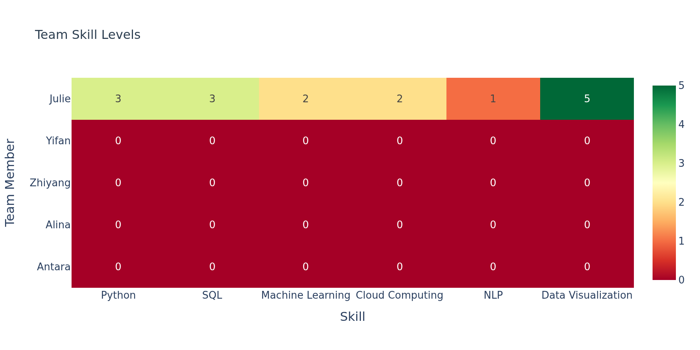
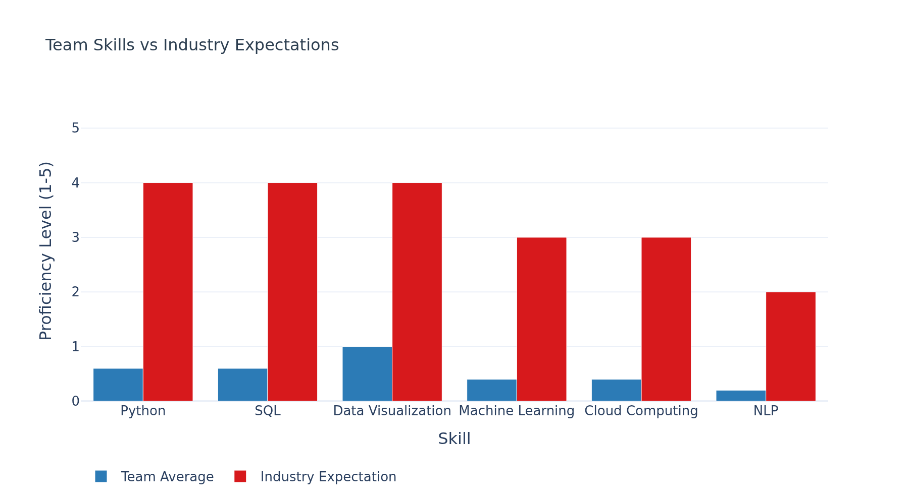

## Overview

This section compares the skills required in IT job postings against the actual skills of our group members to identify knowledge gaps and areas for improvement.

Proficiency scale: **1 = Beginner → 5 = Expert**

---

## Team Skill Levels

```{python}
import pandas as pd
import plotly.express as px
import plotly.graph_objects as go
import os

# Shared Plotly theme — must match eda.qmd
PLOTLY_THEME = dict(
    template="plotly_white",
    font=dict(family="Arial", size=13),
    title_font=dict(size=16, color="#2c3e50"),
    colorway=["#2c7bb6", "#d7191c", "#fdae61", "#1a9641"]
)

# TODO: Each teammate fills in their own row before final submission
skills_data = {
    "Name":               ["Julie", "Yifan", "Zhiyang", "Alina", "Antara"],
    "Python":             [3,       0,        0,         0,       0],
    "SQL":                [3,       0,        0,         0,       0],
    "Machine Learning":   [2,       0,        0,         0,       0],
    "Cloud Computing":    [2,       0,        0,         0,       0],
    "NLP":                [1,       0,        0,         0,       0],
    "Data Visualization": [5,       0,        0,         0,       0],
}

df_skills = pd.DataFrame(skills_data).set_index("Name")
df_skills
```

---

## Skill Heatmap

```{python}
os.makedirs("figures", exist_ok=True)

fig = px.imshow(
    df_skills,
    text_auto=True,
    color_continuous_scale="RdYlGn",
    zmin=0,
    zmax=5,
    aspect="auto",
    title="Team Skill Levels (1=Beginner, 5=Expert)",
    **{k: v for k, v in PLOTLY_THEME.items() if k in ["template"]}
)
fig.update_layout(
    font=PLOTLY_THEME["font"],
    title_font=PLOTLY_THEME["title_font"],
    coloraxis_colorbar=dict(title="Level"),
    xaxis_title="Skill",
    yaxis_title="Team Member"
)

fig.write_image("figures/skill_heatmap.png", width=900, height=450, scale=2)
fig.show()
```



---

## Team Average vs Industry Expectation

```{python}
# Industry expectations for IT/data roles (sourced from Lightcast top skills)
industry_expectation = {
    "Python":             4,
    "SQL":                4,
    "Machine Learning":   3,
    "Cloud Computing":    3,
    "NLP":                2,
    "Data Visualization": 4,
}

team_avg = df_skills.mean().round(2)
industry = pd.Series(industry_expectation)

gap_df = pd.DataFrame({
    "Team Average":         team_avg,
    "Industry Expectation": industry,
}).reset_index().rename(columns={"index": "Skill"})

gap_df["Gap"] = (gap_df["Industry Expectation"] - gap_df["Team Average"]).round(2)
gap_df = gap_df.sort_values("Gap", ascending=False)

fig2 = go.Figure()
fig2.add_trace(go.Bar(
    name="Team Average",
    x=gap_df["Skill"],
    y=gap_df["Team Average"],
    marker_color="#2c7bb6"
))
fig2.add_trace(go.Bar(
    name="Industry Expectation",
    x=gap_df["Skill"],
    y=gap_df["Industry Expectation"],
    marker_color="#d7191c"
))
fig2.update_layout(
    barmode="group",
    title="Team Skills vs Industry Expectations",
    xaxis_title="Skill",
    yaxis_title="Proficiency Level (1–5)",
    yaxis=dict(range=[0, 5.5]),
    legend=dict(orientation="h", y=-0.2),
    font=PLOTLY_THEME["font"],
    title_font=PLOTLY_THEME["title_font"],
    template=PLOTLY_THEME["template"]
)

fig2.write_image("figures/skill_gap_bar.png", width=900, height=500, scale=2)
fig2.show()
```



---

## Improvement Plan

| Team Member | Priority Skills | Recommended Resources |
|---|---|---|
| Julie | NLP, Machine Learning | fast.ai, Hugging Face course |
| Yifan | TBD | TBD |
| Zhiyang | TBD | TBD |
| Alina | TBD | TBD |
| Antara | TBD | TBD |

### Team Collaboration Plan

- **Julie** leads: Data Visualization, EDA
- **Yifan** leads: TBD
- **Zhiyang** leads: TBD
- **Alina** leads: TBD
- **Antara** leads: Data Cleaning, SQL, Business Analytics
